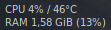
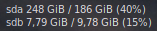
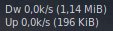

# simple-conky

A simple conky configuration for using in Conky and Conky Manager 2.

## How to install

Clone or download this repo in yor disk and copy Simple folder in your ./config/conky directory. 
Copy conky-startup.sh in your Conky folder if you are going to use Conky Manager2 to modify these config files to your needs.

And done!
